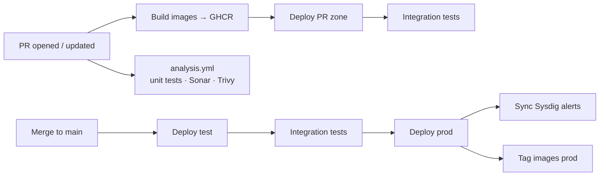

# Architecture

This document explains how the Coast Selling Price (CSP) System is put together: its runtime components, the code layout of each tier, and how it is built, tested and deployed. For local setup, see [README.md](README.md). For security reporting and controls, see [SECURITY.md](SECURITY.md).

> `.github/graphics/architecture.svg` is left over from the bcgov quickstart template. It shows a Node/Nest API and Postgres, and does **not** describe this system.

## System overview

```mermaid
flowchart LR
    user([IDIR user<br/>browser])

    subgraph aws[AWS]
        cognito[Cognito user pool<br/>federated via FAM]
    end

    subgraph ocp[OpenShift Gold namespace — one set per ZONE]
        route{{Route<br/>edge TLS}}
        subgraph fe[frontend Deployment ×2]
            caddy[Caddy :3000<br/>SPA + /api reverse proxy]
        end
        subgraph be[backend Deployment, HPA 1–2]
            init[init container<br/>Oracle wallet fetch]
            spring[Spring Boot :8080]
        end
        pvc[(api-cert PVC<br/>/cert)]
        cm[/amplify-config ConfigMap/]
    end

    oracle[(Oracle DB<br/>THE schema<br/>TCPS :1543)]

    user -- HTTPS --> route --> caddy
    user -- OAuth code flow --> cognito
    caddy -- /api/* --> spring
    cm -. mounted as amplify-config.js .-> caddy
    init --> pvc --> spring
    spring -- JDBC / TCPS --> oracle
    spring -. JWKS fetch .-> cognito
```

| Component | Technology | Responsibility |
|---|---|---|
| Frontend | React 19, TypeScript 6, Vite 8, Carbon (`@carbon/react` + `@bcgov-nr/nr-theme`), TanStack Query 5, axios, AWS Amplify 6 | Single-page app. Served as static files by Caddy 2, which also reverse-proxies `/api/*` to the backend and sets the security headers |
| Backend | Spring Boot 4.1 on Java 21 (built with Temurin 21, running on a JRE 25 image) | REST API under `/api`, JWT validation, business rules, XML submission validation, and JasperReports PDF/CSV generation |
| Database | Oracle (legacy `THE` schema), via ojdbc11 over TCPS | System of record. The report stored procedures (`CSP_SP_RPT_*`) live here |
| Identity | AWS Cognito, federated through FAM (IDIR via Keycloak/SiteMinder) | Sign-in, ID tokens with the `cognito:groups` claim, and federated sign-out |

The backend has no Route. Browsers reach it only through Caddy, on the same origin as the SPA, so there is no CORS configuration.

## Request flow

1. The browser loads `index.html`, which loads `/amplify-config.js` (the runtime config) and then the app bundle.
2. `main.tsx` configures Amplify from `window.amplifyConfig`. Unauthenticated users see the Welcome page (`/`) and sign in with `signInWithRedirect` to the Cognito hosted UI (`idpName`, e.g. `DEV-IDIR`).
3. The axios client (`frontend/src/config/api/request.ts`, `baseURL: '/api'`, 60 s timeout) attaches `Authorization: Bearer <ID token>` from `fetchAuthSession()` to every request. A `401` response emits a session-expired signal, which signs the user out.
4. Caddy proxies `/api/*` to `${NAME}-backend-${ZONE}:8080`.
5. `JwtRequestFilter` checks the token against the Cognito JWKS (key picked by `kid`), and checks issuer and audience when configured. It then maps `cognito:groups` to authorities and puts the username in the Log4j2 `ThreadContext` (`%X{user}`).
6. The controller calls a service. The service calls one or more JDBC repositories, or renders a Jasper report over a JDBC connection.

## Backend

Package root: `backend/src/main/java/ca/bc/gov/nrs/csp/backend/`

| Package | Contents |
|---|---|
| `config/` | `SecurityConfig`, `DataSourceConfig` (Hikari wrapped in `ValidatingDataSource`, which runs `SELECT 1 FROM DUAL` at startup and fails fast), `CacheConfig` (Caffeine), `SpringDocConfig`, `JasperReportsConfig` plus custom PL/SQL query-executer and REF CURSOR factories, `ClockConfig` (America/Vancouver), `JacksonConfig`, `WebConfig` (Pageable/Sort resolvers), and the `JwtProperties` record |
| `controller/` | REST controllers. Each implements an interface in `controller/api/*Api.java`, which holds the mappings and OpenAPI annotations. Request and response records are in `controller/dto/<feature>/` |
| `service/` | Business services, `JwtService`, `PermissionService`, `ReferenceDataWarmupService`, `R06Service`–`R13Service`. `service/mapper/` has the MapStruct mappers, `service/model/` the domain records, and `service/reporting/` the Jasper rendering |
| `repository/` | JDBC repositories built on `NamedParameterJdbcTemplate` with inline SQL |
| `invoice/` | The invoice validation domain. `manual/` validates invoices entered on screen. `submission/structural/` handles XSD validation, XML parsing and stripping the ESF envelope. `submission/business/` holds the business rules, reference data and submitter resolution. `shared/` has common rule sets and models |
| `filter/` | `JwtRequestFilter` and `MockRequestFilter` (local development only) |
| `security/` | `SecurityContextUtils`: current user and roles, for audit columns |
| `exception/` | `GlobalApiExceptionHandler` (`@RestControllerAdvice`) and the custom exception types |
| `util/` | Constants (`Roles`, `PermissionConstants`, …) and request validators (`util/validation/`) |

### API surface

All endpoints are under `/api`. The OpenAPI document is at `/api/v3/api-docs` and Swagger UI at `/api/swagger-ui/index.html`.

| Area | Base path | Notes |
|---|---|---|
| Health | `GET /api/health` | Static `UP`. It does not check the DB, and it is the liveness probe |
| Search / Inbox | `/api/search`, `/api/clients`, `/api/inbox` | Paged invoice search, client lookup, and the user's inbox |
| Invoices | `/api/invoices` | CRUD, submit, duplicate, status changes, line items, and CSV/PDF export |
| Electronic submissions | `/api/submissions` | Multipart XML: `validate/structural`, `parse`, `validate/business`, `submit` |
| Submission history | `/api/submission-history` | Past submissions and their invoices |
| Sort codes | `/api/sort-codes` | CRUD and PDF/CSV export |
| Flat price conversions | `/api/flat-price-conversions` | CRUD, copy and clear (both audited), and PDF/CSV export |
| Lookups | `/api/lookup/*` | Code tables: maturity, type, status, species, grade, FOB, modelling code, … |
| Reports | `POST /api/R06` … `/api/R13` | R06, R07, R08, R10, R11, R12 and R13, as PDF or CSV |

### Data access

- **There is no JPA or Hibernate.** Repositories run SQL against the `THE` schema through `NamedParameterJdbcTemplate`. `spring-data-commons` is used only for `Page`, `Pageable` and `Sort`. The main tables are `COASTAL_LOG_SALE*`, `CSP_SUBMISSION`, `ELECTRONIC_SUBMISSION`, `LOG_SALE_SORT_CODE`, `LOG_SALE_FLAT_PRICE_CONVERSION` (with an `_AUD` audit table), `CSP_SPECIES_GRADE_XREF`, client views, and code tables.
- **Reports** are JRXML templates in `src/main/resources/reports/` (each has a `_CSV` variant, plus subreports). `JasperReportRenderer` passes in a JDBC connection, and most templates call the Oracle stored procedures `CSP_SP_RPT_*` directly (`<query language="plsql">{call …}`). They use custom executer and REF CURSOR factories registered in `jasperreports.properties`. R13 (ad hoc) uses plain SQL, and its columns are adjusted at runtime with dom4j.
- **Electronic submissions** are validated against `schemas/csp/mof-csp.xsd`. JAXB classes are generated from it at build time (`jaxb-maven-plugin`).
- Transactions are declared with `@Transactional` on service methods.
- The Hikari pool holds 2–10 connections, with a 5-minute keepalive and a 30-minute max lifetime.

### Caching

`LookupService` methods are `@Cacheable`, backed by Caffeine (11 named caches, 12-hour `expireAfterWrite`, at most 1000 entries each). `ReferenceDataWarmupService` preloads all lookups at startup, so the first user after a deploy doesn't pay the cold-start cost. `SortCodeService` evicts `sortCodes` on writes. For background, see [docs/investigations/reference-data-cold-start.md](docs/investigations/reference-data-cold-start.md). That note describes an earlier `ConcurrentMapCacheManager`, which has since been replaced by Caffeine.

### Security model

- `SecurityConfig` is stateless, with CSRF disabled (bearer tokens only) and a `401` entry point. `/api/health` and the OpenAPI/Swagger paths are public; everything else requires authentication.
- **Roles.** There are three roles: `VIEW`, `APPROVE` and `ADMIN` (`util/constants/Roles.java`), held as plain authorities without the `ROLE_` prefix. A Cognito group grants a role when it equals the role name or ends with `_<ROLE>`, e.g. `CSP_ADMIN` grants `ADMIN`. The frontend's `RealAuthProvider` applies the same rule.
- **Permissions.** Write endpoints on invoices, sort codes and flat price conversions use `@PreAuthorize("@permissionService.hasPermission(authentication, '<action>')")`. `PermissionConstants.ROLE_PERMISSIONS` maps each role to FAM-matrix action strings such as `invoiceDetails/Approve`. The frontend has a copy in `frontend/src/context/auth/permissions.ts`, and **the two must be kept in sync**. Read, report, search, lookup and submission endpoints only require authentication.
- **Mock auth.** When `auth.mock.enabled=true`, `MockRequestFilter` authenticates every request as `local-dev-user` with the roles in `AUTH_MOCK_ROLES`. It is for local development only.

### Errors and logging

- `GlobalApiExceptionHandler` maps exceptions to an `ApiError { code, message }` body, or to `ValidationErrorResponse` for field-level validation. Status codes: 400 for bad input, 401 for JWT failures, 403 when access is denied, 404, 409 for conflicts, 422 when a request can't be processed, and 500 for DB-procedure or report failures and anything uncaught. The API does not use ProblemDetail.
- Logging is Log4j2, console only (`log4j2-spring.xml`), with the pattern `%d [%t] %-5p %c{1} - [%X{user}] %m`. Levels are set per environment through `LOGGING_LEVEL_*` env vars, which come from the GitHub variables.

### Configuration profiles

All profiles live in the single `backend/src/main/resources/application.yml`.

| Profile | Purpose |
|---|---|
| (default) | springdoc paths, submission-validation settings, `security.jwt.*` from env vars, and log levels |
| `local` | Empty fallbacks for datasource and JWT settings, mock auth on by default, and DEBUG logging. It still needs a reachable DB and a well-formed `JWT_JWKS_URI` |
| `prod` | Datasource env vars required, and `auth.mock.enabled: false`. This is the profile used in OpenShift |

## Frontend

Source root: `frontend/src/`

| Folder | Contents |
|---|---|
| `main.tsx`, `App.tsx` | Bootstrap. Amplify is configured here unless the app runs in mock mode. `App.tsx` sets up the providers and the router (`BrowserRouter`), and lazy-loads every page |
| `env.ts`, `amplify-initializer.ts` | Read `window.amplifyConfig` and map it to Amplify v6 config (OAuth code flow) |
| `config/` | The axios client (`api/request.ts`), TanStack Query defaults (3-hour `staleTime`/`gcTime`, no refetch on focus, no retry), and FAM config |
| `context/` | React Context providers: `auth/` (Real vs Mock provider, idle timeout, permissions, `usePermission`), plus theme, notification, layout and page title |
| `services/` | One `*.service.ts` per feature, containing hand-written TypeScript types and TanStack Query hooks over the axios client. **No types are generated from OpenAPI**, so DTO changes must be mirrored by hand |
| `pages/` | One folder per screen (see routes) |
| `components/` | `Form/` (Carbon form wrappers, editable tables), `Layout/` (header, side nav, profile panel, mock role selector), `core/` (shared presentational components) |
| `routes/` | `routePaths.ts`, side-nav tree (`navigation.ts`), and `ProtectedRoute` (checks authentication only) |
| `hooks/`, `utils/`, `validations/` | Shared hooks (e.g. `usePersistentState` backed by sessionStorage), formatting, the `logoutChain`, report filename parsing, and client-side form validation |

**Routes.** The public routes are `/` (Welcome) and `/logout`, which redirects to `/` and exists because FAM registers `<app>/logout` as the sign-out URL. The protected routes are `/search`, `/inbox`, `/invoice[/:id]`, `/upload-submission`, `/submission-history[/:submissionId]`, `/sort-code`, `/table-maintenance/flat-price-conversion` and `/reports/r06…r13`.

**State.** Server state lives in TanStack Query and app state in React Context. Table and search state persist in sessionStorage. The app uses no Redux or other global store.

**Runtime configuration.** Nothing environment-specific is baked into the build. `index.html` loads `/amplify-config.js`, which sets `window.amplifyConfig` (keys are typed in `env.ts`). In OpenShift the file is generated as a ConfigMap by `common/openshift.init.yml` and mounted over the placeholder. Locally it is a git-ignored file that you create yourself (see the README).

**Sign-out.** `utils/logoutChain.ts` builds a nested redirect: SiteMinder `logoff.cgi` → Keycloak end-session → Cognito `/logout` → app `/logout`. A short-lived popup also clears loginproxy's `idir` realm session. If any `logout*` config value is missing, sign-out falls back to Amplify `signOut()`. Idle users are signed out after `idleTimeoutMinutes` (default 30).

**PWA.** `vite-plugin-pwa` registers an auto-updating service worker. `/api/` is excluded from its navigation fallback.

## Build and deployment

### Container images

| Image | Stages |
|---|---|
| `backend/Dockerfile` | 1. Maven build on Temurin 21. 2. JRE 25 plus optional corporate certs from `backend/certs/`. 3. JRE 25 runtime as non-root `appuser`. The generated entrypoint merges `/cert/jssecacerts` (from the init container) into the trust store, then starts Java with timezone `America/Vancouver` |
| `frontend/Dockerfile` | 1. Node 24 `npm ci` + `vite build`. 2. `dev` target (Vite dev server, used by `docker-compose.override.yml`). 3. `caddy:2-alpine` serving `build/` as user `caddy` on port 3000 |

Images are published to `ghcr.io/bcgov/nr-csp/{backend,frontend}`, tagged with the PR number and head SHA. Deployed prod images are also tagged `prod`.

### OpenShift

Each deployment gets its own **ZONE**: `test`, `prod`, or the PR number mod 50 for PR environments. Every object name includes the ZONE, so the environments are isolated from each other.

| Template | Creates |
|---|---|
| `common/openshift.init.yml` (applied first) | Backend Secret (DB credentials, `KEYSTORE_SECRET`), backend ConfigMap (profile, `JWT_*`, `AUTH_MOCK_*`, `JAVA_OPTS`), frontend ConfigMaps (log level, `amplify-config.js`), and NetworkPolicies (router → frontend; same-zone frontend and monitoring → backend) |
| `backend/openshift.deploy.yml` | Deployment with the Oracle wallet init container (`ghcr.io/bcgov/nr-forest-client/common:prod`, TCPS 1543) writing to a per-zone RWX PVC mounted at `/cert`. Also a Service and an HPA (1–2 replicas, CPU). Liveness probe: `/api/health`; readiness probe: TCP 8080 |
| `frontend/openshift.deploy.yml` | Deployment (2 replicas) with the `amplify-config.js` ConfigMap mounted via subPath, a Service, and a Route `nr-csp-<zone>.apps.gold.devops.gov.bc.ca` (edge TLS, HTTP redirects to HTTPS) |

Pods run with `readOnlyRootFilesystem`, all capabilities dropped, and no service-account token mounted. PR deployments use lite mode (one replica, no HPA or PDB).

Values that differ per environment, such as Cognito and logout settings, are passed to the **init** template. They can't go in the deploy matrix, because GitHub resolves matrix variables before the job's environment is attached.

### CI/CD



| Workflow | Purpose |
|---|---|
| `pr-open.yml` | Build and push images, deploy the PR zone, run `reusable-tests.yml` |
| `pr-validate.yml` / `pr-close.yml` | Add environment links to the PR / remove the PR zone's objects on close |
| `merge.yml` | Deploy the merged PR's images (no rebuild) to test, run the tests, deploy to prod, sync Sysdig alerts, tag images `prod` |
| `analysis.yml` | Backend `mvn -DskipITs verify` + JaCoCo, frontend lint + Vitest coverage, SonarCloud, Trivy. The `Analysis Results` job is the merge gate |
| `scheduled.yml` | Weekly: close stale issues and PRs, purge PR zones older than a week, publish SchemaSpy, run a ZAP scan against test |
| `reusable-deploy.yml` | Apply the init template, then the backend and frontend templates (`bcgov/action-deployer-openshift`) |
| `reusable-tests.yml` | Oracle Testcontainers integration tests, the Node smoke test (`common/tests/integration`), and the Playwright `deployed` smoke project |

Monitoring alerts (crash loops, replica count, restarts) are Sysdig templates in `monitoring/alerts/`.

## Testing

| Layer | Tooling | Location |
|---|---|---|
| Backend unit | JUnit 5 + Mockito. Controllers are tested directly, without MockMvc | `backend/src/test/java` (`*Test.java`) |
| Backend integration | Testcontainers `gvenzl/oracle-free`, bootstrapped by `db/test-bootstrap.sql` (creates the `THE` schema, seed data and stub `CSP_SP_RPT_*` procedures). Skipped when Docker isn't available | `*IT.java` (failsafe) |
| Frontend unit | Vitest 5 (`node` project with happy-dom; opt-in `browser` project with Playwright) + Testing Library | `frontend/src/**/*.unit.test.ts(x)` |
| Deployed smoke | Node script (health, OpenAPI, 401 without a token) and Playwright `deployed` project | `common/tests/integration`, `frontend/e2e/deployed` |
| E2E (local) | Playwright + playwright-bdd, run against a local stack with a seeded Oracle image | `frontend/e2e` (see its README) |

## Known quirks and technical debt

- **Stale role names in `.env.example`.** Its comments list `CSP_VIEWER`, `CSP_SUBMITTER` and `CSP_APPROVER`, but the code only recognizes groups ending in `_VIEW`, `_APPROVE` or `_ADMIN`. Check which group names FAM actually issues, and fix whichever side is wrong.
- **Local dev needs a DB and a JWKS URL.** `ValidatingDataSource` and `JwtService` fail at startup even under the `local` profile when these are missing.
- **Java 21 compile, JRE 25 runtime.** The build and runtime Java versions differ in `backend/Dockerfile`.
- **Unused serving cert.** The backend Service requests an OpenShift serving cert and mounts it at `/etc/tls-certs`, but the app only serves plain HTTP on 8080.
- **Page-level permissions aren't enforced in the UI.** `usePageAccess` exists but nothing uses it. `ProtectedRoute` checks authentication only, and the backend enforces permissions only on write endpoints.
- **Template leftovers:** `.github/graphics/*`, the SchemaSpy job, `API_NAME: nest` in `reusable-tests.yml`, `frontend/src/config/api/CancelablePromise.ts`, and the out-of-date header comment in `frontend/openshift.deploy.yml` (config is injected at runtime, not baked in at build time).
